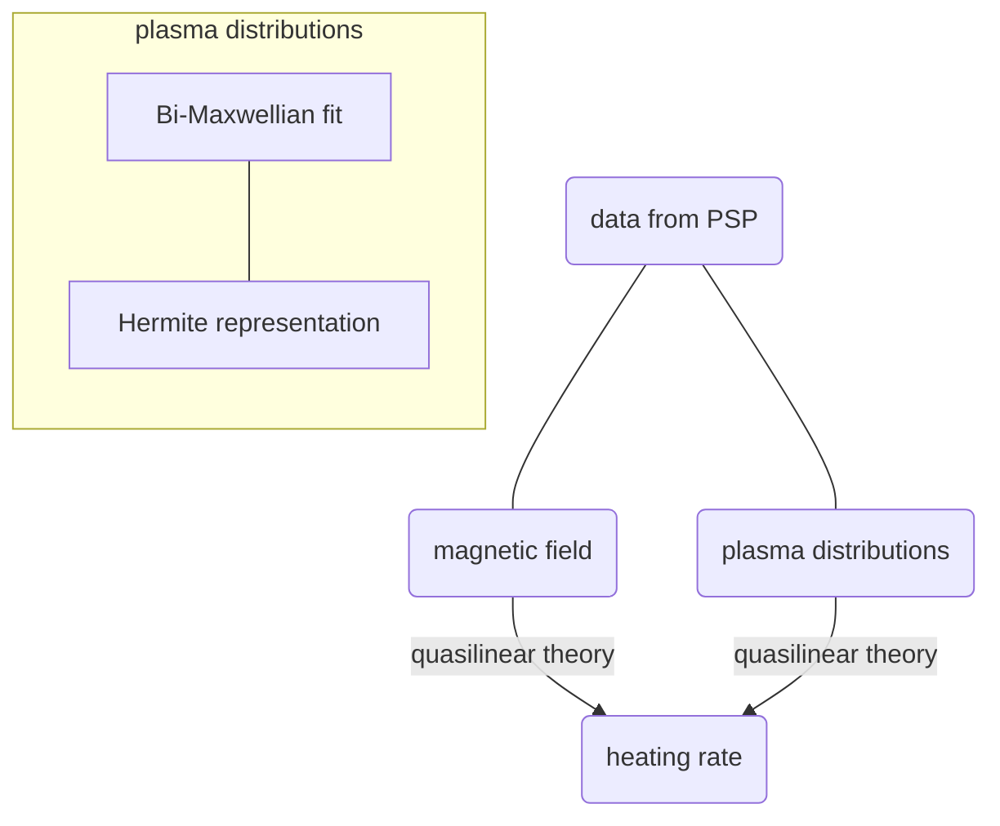


由于科研需要，最近看了几篇关于 **回旋共振** 的文章，都发表在高水平的期刊上，很多地方值得学习和借鉴，一些有趣的结论也方便之后更加深入的研究，所以下面对这几篇文章做简单的介绍。借此锻炼自己总结阅读能力，方便自己以后参阅


# 1. In Situ Signature of Cyclotron Resonant Heating in the Solar Wind

>[In Situ Signature of Cyclotron Resonant Heating in the Solar Wind](10.1103/PhysRevLett.129.165101) ——— Trevor A. Bowen et al.

一直以来关于日冕加热和太阳风加速的物理机制得不到完美的解释，随机加热，磁重联，以及朗道或者回旋共振加热等一系列理论都是存在潜在可能的能量耗散机制，另外电子和离子对能量耗散各自贡献的比例也仍然是一个公开讨论的问题。

这篇文章利用 Parker Solar Probe (PSP) 的观测数据对离子回旋共振加热的贡献作了定量估计，得到了一些有趣的结果。大致的研究过程如下：

文中将PSP测到的等离子体速度分布函数用两种方式进行了插值:
1. 双麦克斯韦分布形式
2. Hermite 表示形式

两者的主要差别在于 Hermite 表示下具有更加精细的速度分布结构。根据前人建立的离子回旋波加热准线性理论，在有了磁场波动数据和等离子体速度分布函数之后可以估计加热率（heating rate）。经过这么一算呢，发现 Bi-Maxwellian 拟合出来的分布加热率平均下来是 $3 \times 10^{-15} \mathrm{W/m^{3}}$，Hermite 拟合出来的结果为 $1 \times 10^{-14} \mathrm{W/m^3}$，这个结果表明分布函数的精细结构不会对加热的结果造成数量级上的影响，但仍然是不能忽略的（毕竟存在精细结构的估算出来差不多是没有的两倍了）。同时呢，这个结果和前人算出来的湍流串级的能量率 $4.7 \times 10^{-14} \mathrm{W/m^3}$ 是相当的，表明了回旋加热在这个过程中的重要性，可以作为一种重要的能量耗散机制存在，将磁能转化为离子的热能和动能。

同时作者也指出了一些存在的小问题，首先是文中考虑的都是平行传播的离子回旋波，对于倾斜离子回旋波的情况还需要进一步讨论；另外研究的时间间隔内观测到的磁场波动 95% 都是左旋极化的波，同时分布函数计算的结果显示基本上都是波的吸收从而提供给离子能量，那么这些波是如何产生的就是一个比较重要的问题，文中提出两种可能的机制：1. beam 分布的不稳定性可以导致离子回旋波，但问题是这样产生的波的极化特性是右旋的，2. 湍流产生的大量左旋极化离子回旋波，对于这种机制文中也给出了一些近年来的支撑证据。

文章总体的工作思路还是比较简单的，过程可能会比较复杂，发表在PRL上，而且是编辑推荐文章，含金量肯定是很高的。也可以为我们想要量化一种波粒相互作用在空间物理过程中的贡献时提供研究思路。
